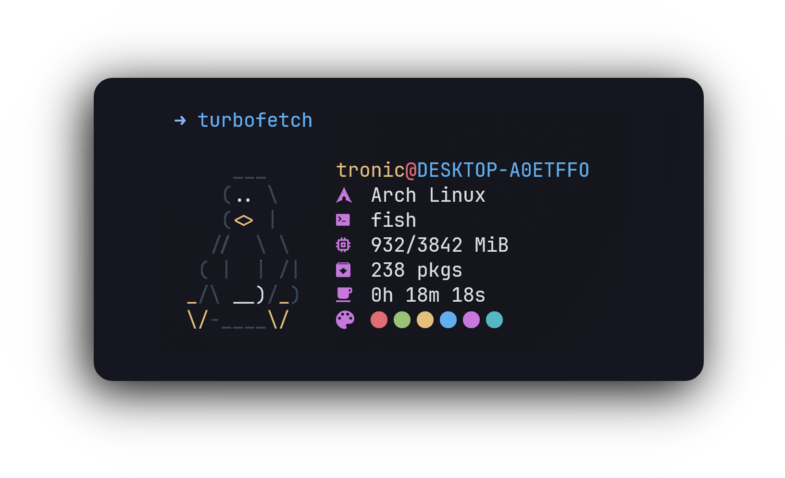

### _turbofetch_
A _blazingly-fast_ fetch cli tool written in C for Linux. Based on [nerdfetch](https://github.com/ThatOneCalculator/NerdFetch)


# Installation
Run
```bash
curl -ffSL https://raw.githubusercontent.com/ajTronic/turbofetch/main/install.sh | sh
```

# Usage
```bash
turbofetch
```

# Requirements
- Linux
- A [nerd font](https://www.nerdfonts.com/) as your terminal font.
